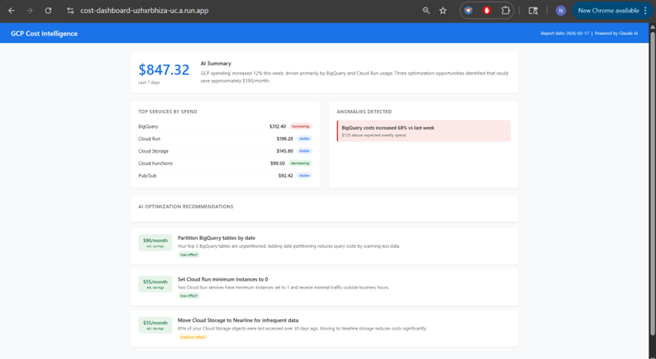
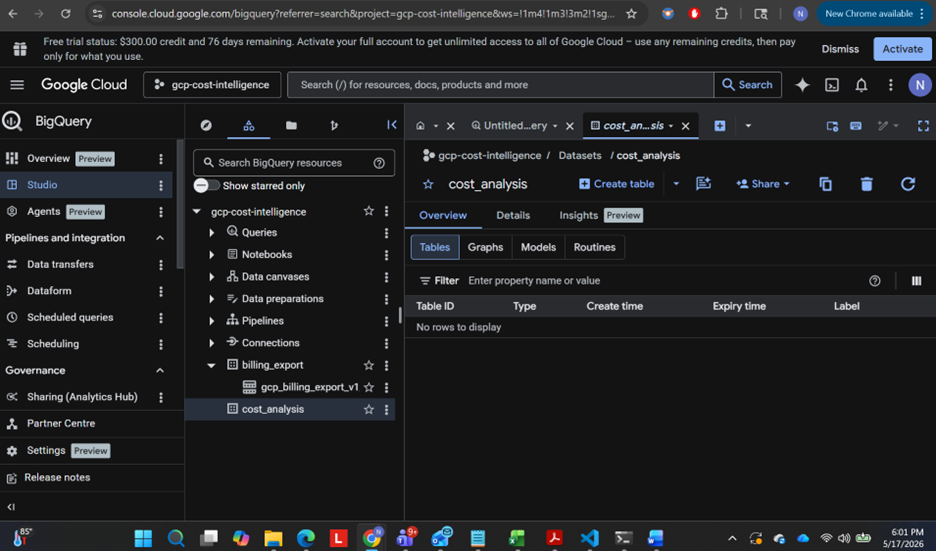
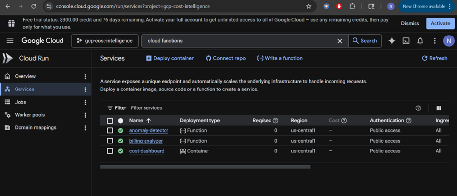
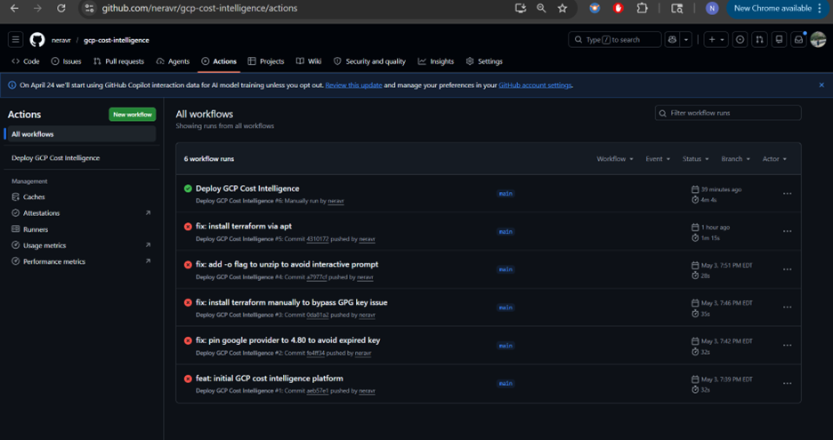

# GCP Cost Intelligence Platform

A cloud cost intelligence platform built on GCP that automatically analyzes your billing data, detects spending anomalies, and delivers AI-powered optimization recommendations — through a live dashboard and daily email reports.

Built to demonstrate end-to-end GCP engineering: BigQuery, Cloud Functions, Cloud Run, Pub/Sub, Cloud Scheduler, Terraform, and the Claude API.

---

## The problem this solves

Cloud bills are hard to read. GCP's billing console shows you numbers but not insights. You know BigQuery cost $312 last week — but is that normal? Is it trending up? What should you do about it?

This platform answers those questions automatically. Every morning it queries your billing data, sends it to Claude, and produces a plain English report: what changed, what's anomalous, and exactly what to do to reduce costs — with estimated savings per recommendation.

At Capgemini I found $500K in annual cloud waste across 15 client accounts by doing this manually. This project automates that process.

---

## How it works

```
GCP Billing export → BigQuery (daily, automatic)
         ↓
Cloud Scheduler triggers billing-analyzer (daily 8am UTC)
         ↓
Cloud Function queries BigQuery for last 7 days
         ↓
Claude API analyzes spending patterns
  - Plain English summary
  - Top services by spend with trends
  - Anomalies detected
  - Optimization recommendations with $ savings
         ↓
Results saved to BigQuery (cost_analysis dataset)
Email report sent via SendGrid
         ↓
Cloud Run dashboard reads from BigQuery
Shows live cost intelligence UI
         ↓
Anomaly detector runs in parallel
Publishes spikes to Pub/Sub
Dashboard picks up real-time anomaly alerts
```

---

## Architecture

```
┌─────────────────────────────────────────────────────────┐
│                    GCP Billing Export                    │
│              (automatic daily to BigQuery)               │
└──────────────────────────┬──────────────────────────────┘
                           │
              ┌────────────▼────────────┐
              │    Cloud Scheduler      │  triggers daily at 8am UTC
              └────────────┬────────────┘
                           │
         ┌─────────────────┼─────────────────┐
         │                 │                 │
┌────────▼────────┐ ┌──────▼──────┐ ┌───────▼───────┐
│ billing-analyzer│ │  anomaly-   │ │  cost-dashboard│
│ Cloud Function  │ │  detector   │ │  Cloud Run     │
│                 │ │  Cloud Fn   │ │                │
│ BigQuery query  │ │ spike detect│ │ Flask web app  │
│ Claude analysis │ │ Claude expl │ │ BigQuery reads │
│ SendGrid email  │ │ Pub/Sub pub │ │ Pub/Sub sub    │
└─────────────────┘ └─────────────┘ └────────────────┘
         │                 │                 │
         └─────────────────▼─────────────────┘
                    BigQuery
              cost_analysis dataset
              (stores Claude's output)
```

---

## Tech stack

| Component | Technology |
|-----------|-----------|
| Cloud | GCP (BigQuery, Cloud Functions, Cloud Run, Cloud Scheduler, Pub/Sub) |
| Infrastructure as Code | Terraform |
| AI Analysis | Claude API (Anthropic) |
| Email reports | SendGrid |
| Dashboard | Flask + Cloud Run |
| CI/CD | GitHub Actions |
| Data | GCP Billing Export → BigQuery |

---

## Screenshots

### Live dashboard — AI-powered cost intelligence


### BigQuery datasets — billing export + analysis results


### Cloud Functions — billing analyzer + anomaly detector


### GitHub Actions — successful deployment


---

## Repository structure

```
gcp-cost-intelligence/
├── terraform/
│   ├── main.tf           # BigQuery, Pub/Sub, IAM, Cloud Scheduler
│   ├── variables.tf
│   ├── outputs.tf
│   └── terraform.tfvars
├── functions/
│   ├── billing_analyzer/
│   │   ├── main.py       # BigQuery query + Claude analysis + email
│   │   └── requirements.txt
│   └── anomaly_detector/
│       ├── main.py       # Spike detection + Claude explanation + Pub/Sub
│       └── requirements.txt
├── dashboard/
│   ├── main.py           # Flask app + BigQuery + Pub/Sub reads
│   ├── templates/
│   │   └── index.html    # Cost intelligence UI
│   ├── Dockerfile
│   └── requirements.txt
└── .github/workflows/
    └── deploy.yml        # Deploy everything to GCP
```

---

## Running it yourself

**Prerequisites:** GCP account with billing enabled, Terraform, gcloud CLI, SendGrid account, Anthropic API key.

**1. Create GCP project and enable APIs**
```bash
gcloud projects create gcp-cost-intelligence
gcloud config set project gcp-cost-intelligence

gcloud services enable \
  bigquery.googleapis.com \
  cloudfunctions.googleapis.com \
  cloudscheduler.googleapis.com \
  run.googleapis.com \
  pubsub.googleapis.com \
  cloudbuild.googleapis.com \
  cloudresourcemanager.googleapis.com
```

**2. Enable billing export to BigQuery**
```
GCP Console → Billing → Billing export → BigQuery export
Dataset: billing_export
```

**3. Create GCS bucket for Terraform state**
```bash
gsutil mb -p gcp-cost-intelligence -l us-central1 gs://gcp-cost-intelligence-tfstate
```

**4. Add GitHub secrets**
```
GCP_SA_KEY          → service account JSON key
GCP_PROJECT_ID      → gcp-cost-intelligence
ANTHROPIC_API_KEY   → sk-ant-...
SENDGRID_API_KEY    → SG....
REPORT_EMAIL        → your@email.com
BILLING_TABLE       → gcp_billing_export_v1_XXXXXX
```

**5. Push to main — GitHub Actions deploys everything**

The dashboard will be available at the Cloud Run URL printed in the job summary.

---

## What I'd add next

- Real-time anomaly Slack notifications via Pub/Sub push subscription
- Budget alerts integration — trigger analysis when spend exceeds threshold
- Multi-project support — aggregate billing across multiple GCP projects
- Looker Studio dashboard connected to the cost_analysis BigQuery dataset
- Historical trend analysis — month over month comparisons

---

## License

MIT
